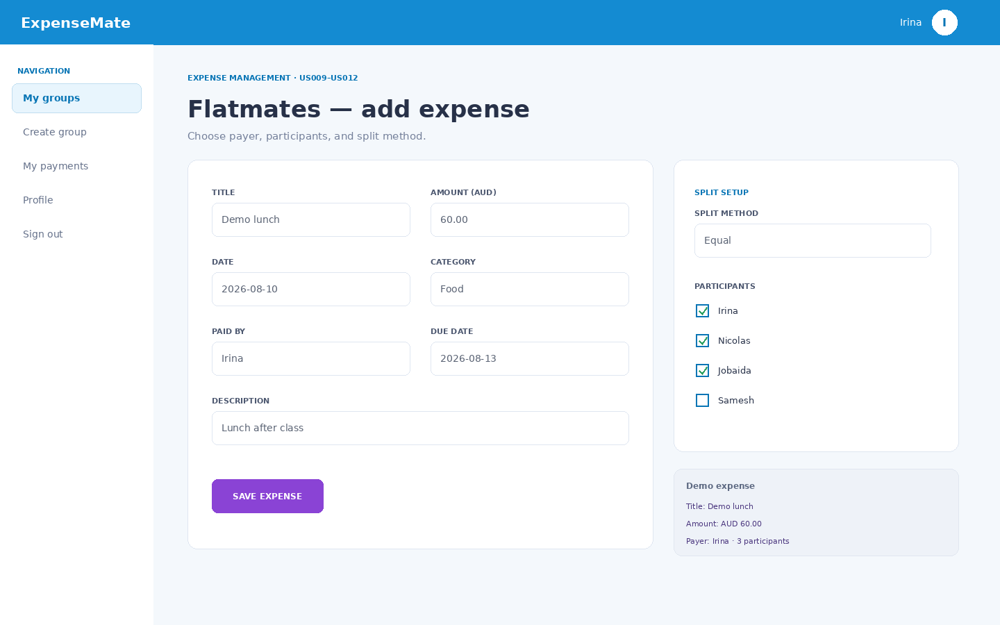
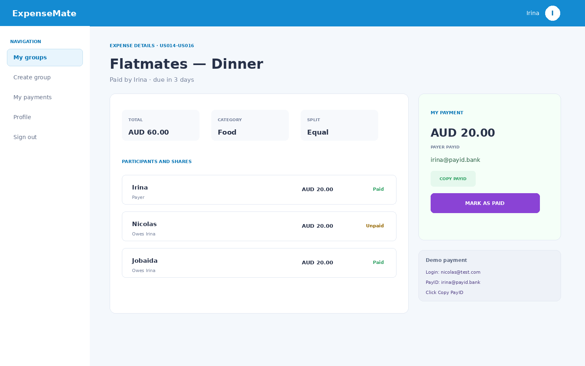

# ExpenseMate

ExpenseMate is a responsive Django web application for students, roommates, friends, and travel groups who need to record shared costs, divide expenses, and track payment status in one place.

This repository is a **complete local demonstration build** for the SDM404 project. It implements the functional user stories and validation/permission scenarios listed in the supplied Assessment 3 test plan while keeping the code intentionally straightforward.


## Implemented user stories

### Account and profile

- **US001:** registration with name, unique email, password, and confirmation;
- **US002:** email/password login with separate wrong-password and unknown-account messages;
- **US003:** add or update PayID;
- **US024:** simplified local password reset.

### Groups and membership

- **US004:** create group and automatically become Group Admin;
- **US005:** view all groups where the user is a member;
- **US006:** invite an existing registered user;
- **US007:** view, accept, or decline invitations;
- **US008:** view group details, members, roles, and recent expenses;
- **US018:** leave a group after personal payment obligations are complete;
- **US020:** Admin edits group information;
- **US022:** Admin deletes a group only when all shares are paid;
- **US023:** Admin removes a member only when the member has no unpaid shares.

### Expenses, search, and payments

- **US009:** add an expense with all required fields;
- **US010:** select the payer;
- **US011:** select expense participants;
- **US012:** equal or custom split;
- **US013:** combined title/category/date search and filtering;
- **US014:** view payer, participants, shares, and status;
- **US015:** view and copy the payer's PayID;
- **US016:** mark the signed-in participant's own share as paid;
- **US017:** display paid, unpaid, due-tomorrow, and overdue reminders;
- **US019:** Admin edits an expense;
- **US021:** Admin deletes an expense;
- **US025:** Admin corrects existing split amounts.

### Roles and permissions

- A **Group Member** can view groups and expenses, add expenses, search, copy PayID, mark their own share paid, and leave when settled.
- A **Group Admin** can also edit/delete the group, invite/remove members, edit/delete expenses, and correct splits.
- Admin-only controls are hidden from Members, and direct access to their URLs returns HTTP 403.

## Important demo simplifications

- **SQLite** is used instead of PostgreSQL so the application starts on a Mac without installing a database server.
- Password reset does not send email. For the local demonstration, a recognised email opens the new-password form directly.
- Payment happens outside ExpenseMate. The app displays/copies PayID and records payment status.
- Reminder status is calculated from the due date when a page is opened; no background email service is required.
- Direct payment gateways, cloud deployment, native mobile code, load testing, penetration testing, and external APIs are outside this build.

## Technology stack

- Python 3.10 or newer
- Django 5.2 LTS
- SQLite
- Django templates
- HTML5 and CSS3
- Bootstrap 5-compatible markup
- small vanilla JavaScript for PayID copy and custom-split visibility
- Django `TestCase`

---

# Run on macOS

## Fastest method

### 1. Download and extract the repository

Open Terminal and move into the extracted folder. The easiest method is to type `cd `, drag the **ExpenseMate** folder into Terminal, and press Return.

Example:

```bash
cd ~/Downloads/ExpenseMate
```

### 2. Start the demo

```bash
bash start_demo.sh
```

The script:

1. creates `.venv`;
2. installs Django;
3. applies migrations;
4. recreates predictable test accounts, groups, invitations, expenses, and shares;
5. starts the local server.

### 3. Open the application

Open this local URL in Safari, Chrome, or Firefox:

**http://127.0.0.1:8000/**

Keep Terminal open while using the application.

### 4. Stop the server

Press:

```text
Control + C
```

## Repeat launch without reinstalling everything

```bash
cd ~/Downloads/ExpenseMate
source .venv/bin/activate
python manage.py setup_demo
python manage.py runserver
```

`setup_demo` resets the seeded demonstration data, so deleted groups, changed passwords, accepted invitations, and paid shares return to their initial state.

## Manual setup

```bash
python3 -m venv .venv
source .venv/bin/activate
python -m pip install --upgrade pip
python -m pip install -r requirements.txt
python manage.py setup_demo
python manage.py runserver
```

---

# Demo accounts

All seeded users use the same password: `Password1234`.

| Role/example | Email | PayID |
|---|---|---|
| Irina — main Group Admin | `irina@test.com` | `irina@payid.bank` |
| Nicolas — Member with unpaid shares and invitations | `nicolas@test.com` | `nicolas@payid.bank` |
| Jobaida — Member with paid shares | `jobaida@test.com` | `jobaida@payid.bank` |
| Samesh — payer/participant example | `samesh@test.com` | `samesh@payid.bank` |

Every application screen includes **one compact demo-data card** for one main test case on that screen. It contains only the values needed during the demonstration, while full steps, expected results, and all negative scenarios remain in [docs/MANUAL_TEST_CASES.md](docs/MANUAL_TEST_CASES.md).






---

# Demonstration test list

The following cases can be demonstrated from the UI. Reset with `python manage.py setup_demo` whenever a case changes or deletes seeded data.

## Functional cases

### Account Management

- [ ] **TC-001:** registration;
- [ ] **TC-002:** successful login;
- [ ] **TC-003:** password reset and login with the new password.

### Profile Management

- [ ] **TC-004:** add or update PayID.

### Group Operations

- [ ] **TC-005:** create group and receive Admin role;
- [ ] **TC-006:** Admin edits group information; Member has no edit control;
- [ ] **TC-007:** delete a fully settled group.

### Membership Management

- [ ] **TC-008:** invite a registered user;
- [ ] **TC-009:** accept or decline an invitation;
- [ ] **TC-010:** leave a settled group;
- [ ] **TC-011:** Admin removes a settled member.

### Expense Management

- [ ] **TC-012:** add expense;
- [ ] **TC-013:** select payer;
- [ ] **TC-014:** select participants and exclude another member;
- [ ] **TC-015:** equal and custom splits;
- [ ] **TC-016:** Admin edits expense; Member cannot edit;
- [ ] **TC-017:** Admin deletes expense;
- [ ] **TC-018:** Admin corrects split amounts.

### Viewing and Searching

- [ ] **TC-019:** view all groups;
- [ ] **TC-020:** view group details, members, roles, and expenses;
- [ ] **TC-021:** title/category/date filtering and combined filters;
- [ ] **TC-022:** view full expense details and share statuses.

### Payment Flow

- [ ] **TC-023:** view and copy PayID;
- [ ] **TC-024:** participant marks their share paid;
- [ ] **TC-025:** paid/due-tomorrow/overdue reminder states.

## Non-functional manual cases

- [ ] **TC-026:** core flow in Chrome;
- [ ] **TC-027:** core flow in Firefox;
- [ ] **TC-028:** core flow in Safari;
- [ ] **TC-029:** 1920×1080 and 1366×768 desktop/laptop layout;
- [ ] **TC-030:** 768×1024 tablet layout;
- [ ] **TC-031:** 375×812 smartphone layout and controls.

## Negative scenarios

- [ ] **TC-N001:** invalid registration email;
- [ ] **TC-N002:** weak password;
- [ ] **TC-N003:** wrong password;
- [ ] **TC-N004:** unknown login email;
- [ ] **TC-N005:** group deletion blocked by unpaid shares;
- [ ] **TC-N006:** password confirmation mismatch;
- [ ] **TC-N007:** leaving a group blocked by unpaid share;
- [ ] **TC-N008:** removing a member blocked by unpaid share;
- [ ] **TC-N009:** custom shares do not total the expense;
- [ ] **TC-N010:** Member cannot edit expense;
- [ ] **TC-N011:** Member cannot delete expense;
- [ ] **TC-N012:** payer cannot mark own payer share paid;
- [ ] **TC-N013:** invite unknown email;
- [ ] **TC-N014:** invite already-invited user;
- [ ] **TC-N015:** invite existing member;
- [ ] **TC-N016:** accept expired invitation;
- [ ] **TC-N017:** missing expense title;
- [ ] **TC-N018:** negative expense amount;
- [ ] **TC-N019:** negative custom share;
- [ ] **TC-N020:** duplicate account;
- [ ] **TC-N021:** duplicate expense;
- [ ] **TC-N022:** duplicate group;
- [ ] **TC-N023:** missing group title or description;
- [ ] **TC-N024:** missing required expense fields;
- [ ] **TC-N025:** no payer selected;
- [ ] **TC-N026:** no participants selected;
- [ ] **TC-N027:** zero expense amount;
- [ ] **TC-N028:** missing account name;
- [ ] **TC-N029:** password reset for unknown email;
- [ ] **TC-N030:** Member cannot delete group;
- [ ] **TC-N031:** Member cannot invite or remove members.

---

# Automated tests

After the environment is active:

```bash
python manage.py test
```

The test modules cover account validation, login, password reset, PayID, group CRUD, invitations, membership rules, permissions, expense CRUD, equal/custom split calculations, duplicate detection, search, PayID display, payment status, and reminders.

You can also run one app at a time:

```bash
python manage.py test accounts
python manage.py test groups
python manage.py test expenses
```

# Project structure

```text
ExpenseMate/
├── accounts/                 # Registration, login, reset, profile and PayID
├── groups/                   # Groups, memberships, invitations and permissions
├── expenses/                 # Expenses, shares, split logic, search and payments
├── expensemate/              # Settings, root URLs and screen test-data mapping
├── templates/
│   ├── accounts/
│   ├── groups/
│   ├── expenses/
│   └── includes/demo_test_data.html
├── static/css/expensemate.css
├── docs/
│   ├── MANUAL_TEST_CASES.md
│   ├── screenshots/
│   └── superpowers/
├── tools/
│   ├── render_screenshots.py
│   └── verify_repository.py
├── manage.py
├── requirements.txt
├── start_demo.sh
└── start_demo.bat
```

# Code design

- Models are grouped by their real responsibility rather than placed in one large app.
- Forms contain input validation; short service modules contain permission and split helpers; views coordinate requests and responses.
- Equal splitting works in cents, so the saved shares always add up exactly to the expense amount.
- Group and member restrictions query unpaid `ExpenseShare` records directly.
- Screen-specific demo values are stored once in `expensemate/demo_data.py`, not repeated across templates.
- The project deliberately avoids APIs, asynchronous jobs, frontend frameworks, and unnecessary abstraction.
