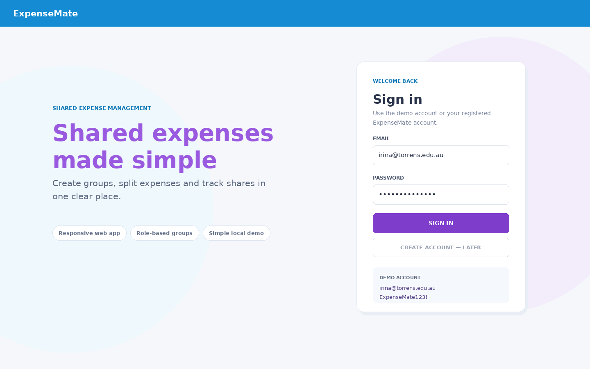
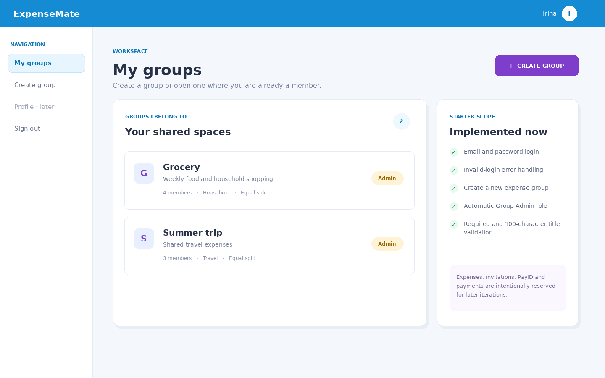
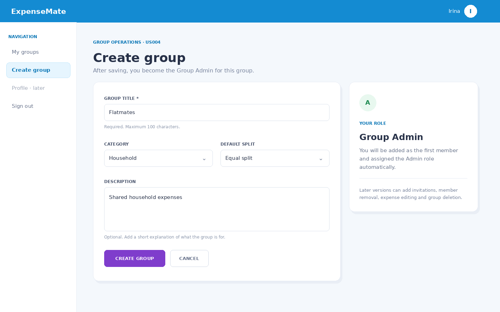
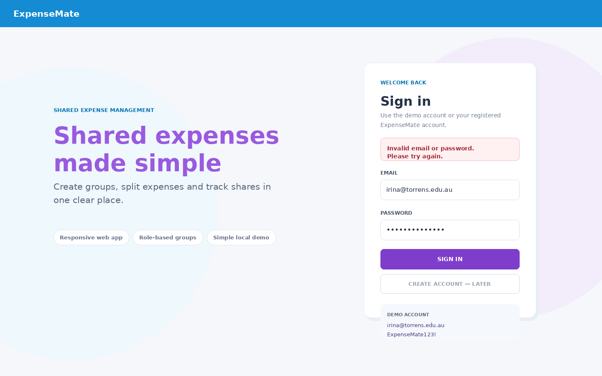
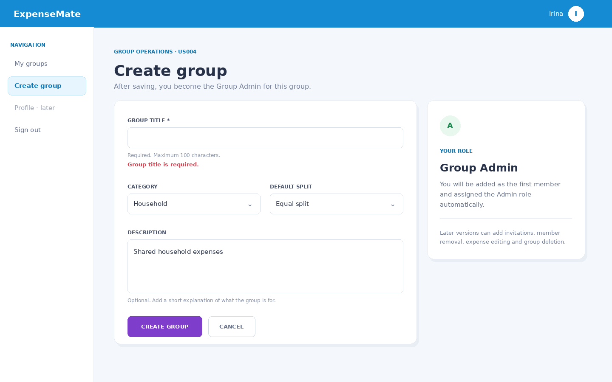

# ExpenseMate

ExpenseMate is a responsive Django web application for managing shared expenses between students, roommates, friends, or travel groups. The complete project scope includes groups, memberships, expenses, split calculations, PayID details, payment statuses, reminders, and role-based permissions.

This repository is an intentionally small **starter MVP**. It implements two foundational user stories from the ExpenseMate requirements:

- **US002 — Login:** a registered user signs in with email and password.
- **US004 — Create Group:** a registered user creates a group and automatically becomes its Group Admin.

The starter also includes the minimum **My Groups** screen needed to demonstrate navigation and confirm that a newly created group was saved.



## Implemented functionality

### Login and authentication

- Login with a unique email address and password.
- Passwords are handled using Django's built-in password hashing.
- Invalid credentials display a generic message:
  `Invalid email or password. Please try again.`
- Unauthenticated users are redirected to the login page.
- Authenticated users who open the login page are redirected to **My Groups**.
- Sessions are configured to expire after 40 minutes of inactivity.

### Create Group

- Create a group with:
  - group title;
  - category;
  - default split method;
  - optional description.
- The signed-in creator is saved as the group's creator.
- An Admin membership is created automatically in the same database transaction.
- An empty title is rejected with `Group title is required.`
- A title longer than 100 characters is rejected with `Group title must be 100 characters or fewer.`
- The **My Groups** page only displays groups where the current user has a membership.





## Current scope boundaries

The following requirements are intentionally not implemented in this first starter:

- account registration and password reset;
- PayID profile management;
- group invitations and member management;
- adding, splitting, editing, or deleting expenses;
- payment statuses and reminders;
- group editing and deletion;
- public cloud deployment or payment-gateway integration.

This keeps the first implementation easy to understand, demonstrate, and extend.

## Technology stack

- Python 3.10 or newer
- Django 5.2.16 LTS
- SQLite
- Django templates
- HTML5 and CSS3
- Bootstrap 5 CDN link with a complete local custom stylesheet, so the interface remains readable even when the CDN is unavailable
- Django `TestCase`

## Application URL

After starting the development server, open:

**http://127.0.0.1:8000/**

This starter is not deployed to a public hosting service. The link above is the local development URL.

## Fastest way to run it

### macOS or Linux

From the repository folder:

```bash
bash start_demo.sh
```

The script creates `.venv`, installs dependencies, applies migrations, prepares demo data, and starts the server.

### Windows

From Command Prompt:

```bat
start_demo.bat
```

Then open **http://127.0.0.1:8000/**.

## Manual setup

### 1. Create a virtual environment

macOS or Linux:

```bash
python3 -m venv .venv
source .venv/bin/activate
```

Windows:

```bat
py -m venv .venv
.venv\Scripts\activate
```

### 2. Install dependencies

```bash
python -m pip install -r requirements.txt
```

### 3. Prepare the database and demo account

```bash
python manage.py setup_demo
```

`setup_demo` is repeatable. It applies migrations and recreates the expected demo users, passwords, groups, and memberships without duplicating them.

### 4. Start the application

```bash
python manage.py runserver
```

### 5. Open the application

Open **http://127.0.0.1:8000/** in Chrome, Safari, or Firefox.

## Demo login

```text
Email:    irina@torrens.edu.au
Password: ExpenseMate123!
```

The demo setup creates two groups for Irina:

- **Grocery** — four members;
- **Summer trip** — three members.

## How to test the implemented scenarios

### Successful login

1. Open **http://127.0.0.1:8000/**.
2. Enter the demo email and password.
3. Select **Sign in**.
4. Confirm that the **My Groups** page appears.

### Invalid login error

1. Enter `irina@torrens.edu.au`.
2. Enter any incorrect password.
3. Select **Sign in**.
4. Confirm that the generic invalid-credentials message appears and access is denied.



### Successful group creation

1. Sign in with the demo account.
2. Select **Create group**.
3. Enter a title such as `Flatmates`.
4. Choose a category and default split.
5. Select **Create group**.
6. Confirm that a success message appears and the group is listed under **My Groups**.
7. Confirm that the role badge is **Admin**.

### Empty group-title error

1. Open **Create group**.
2. Leave **Group title** empty.
3. Select **Create group**.
4. Confirm that `Group title is required.` appears and the group is not saved.



### Group-title length error

1. Open **Create group**.
2. Enter more than 100 characters in the title. The browser limits normal typing to 100 characters; the server-side rule can also be tested through an automated test or a modified request.
3. Confirm that the request is rejected and no group is created.

## Automated tests

Run all Django tests:

```bash
python manage.py test
```

The tests cover:

- successful login;
- invalid-login error handling;
- redirecting unauthenticated users;
- redirecting an already authenticated user away from login;
- group creation;
- automatic Admin membership;
- empty-title validation;
- 100-character title validation;
- preventing users from seeing groups where they have no membership.

## Project structure

```text
ExpenseMate/
├── accounts/                     # Email-based user and login feature
│   ├── migrations/
│   ├── forms.py
│   ├── models.py
│   ├── tests.py
│   ├── urls.py
│   └── views.py
├── expensemate/                  # Django project settings and root URLs
├── groups/                       # Group and GroupMembership feature
│   ├── management/commands/
│   │   └── setup_demo.py
│   ├── migrations/
│   ├── forms.py
│   ├── models.py
│   ├── tests.py
│   ├── urls.py
│   └── views.py
├── templates/
│   ├── accounts/login.html
│   ├── groups/group_form.html
│   ├── groups/group_list.html
│   └── base.html
├── static/css/expensemate.css
├── docs/screenshots/
├── tools/
├── manage.py
├── requirements.txt
├── start_demo.sh
└── start_demo.bat
```

## Design and implementation decisions

- **Email is the login identifier.** ExpenseMate requirements describe login using email and password, so the starter uses a custom Django user model instead of treating email as an optional profile field.
- **Group membership is separate from group ownership.** This supports the future distinction between Group Admin and Group Member without redesigning the database.
- **Creation is atomic.** The group and the creator's Admin membership are stored together; a partial group cannot be left behind if membership creation fails.
- **Errors are safe and specific.** Login errors do not reveal whether an email exists, while group-form errors explain exactly what needs correction.
- **The UI is server-rendered.** This is the smallest implementation consistent with the planned Django stack and is easy to demonstrate locally.

## Inspiration from ExpenseSplitter

The repository uses the strongest high-level ideas from the public reference project:

- a small Django application rather than a separate API and JavaScript frontend;
- a responsive web interface;
- clear separation between models, forms, views, URLs, and templates;
- local SQLite storage for a student MVP;
- a feature-led README with screenshots and a direct demonstration flow.

Reference: https://github.com/wkostusiak/ExpenseSplitter

ExpenseMate's models, role logic, validation rules, templates, tests, and source code were written specifically for the uploaded ExpenseMate requirements. No source files from the reference repository were copied.

## Future development order

A practical next sequence is:

1. user registration and profile/PayID;
2. invitations and Group Member role workflows;
3. add expense with payer and participants;
4. equal and custom split calculation;
5. expense details and Paid/Unpaid/Overdue statuses;
6. search, edit, delete, and reminders.

## License

MIT License. See [LICENSE](LICENSE).
